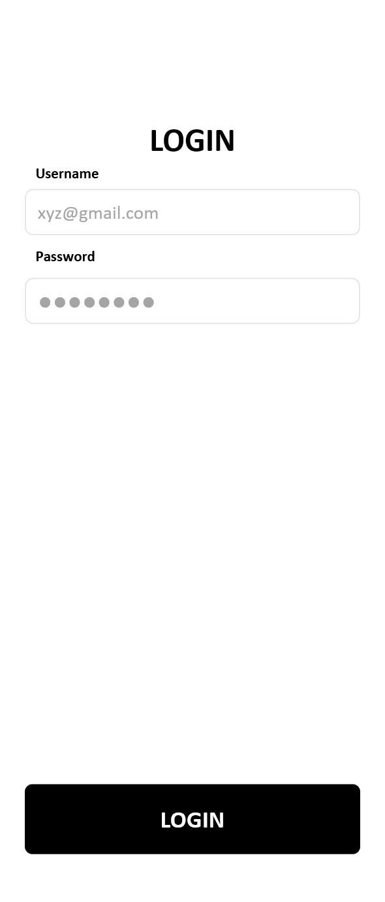
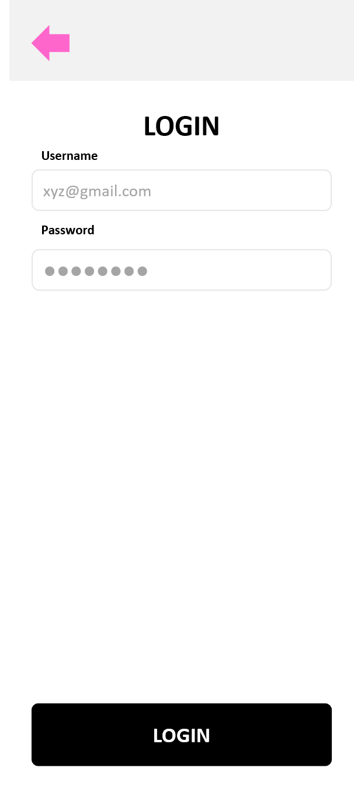
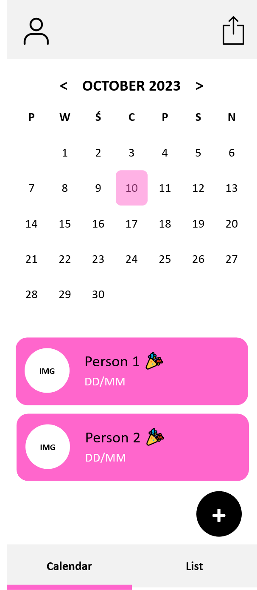
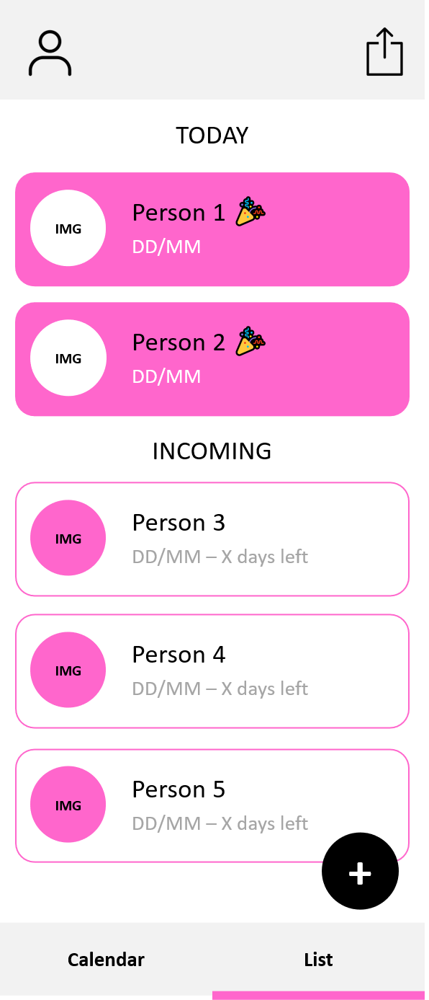
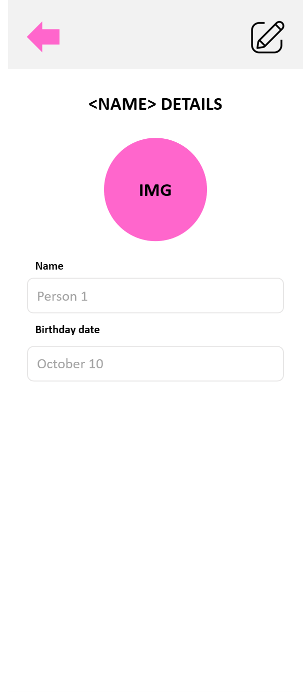
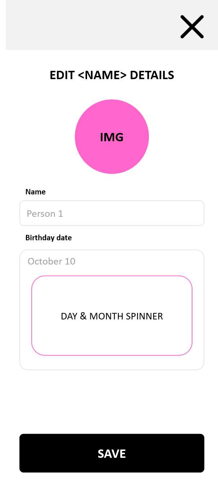
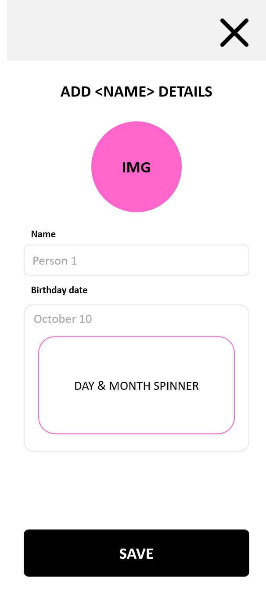
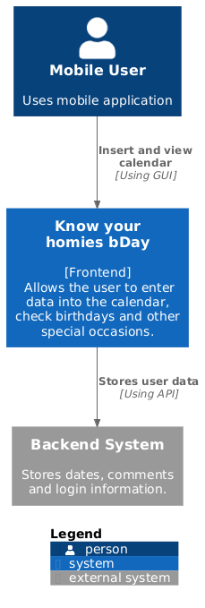
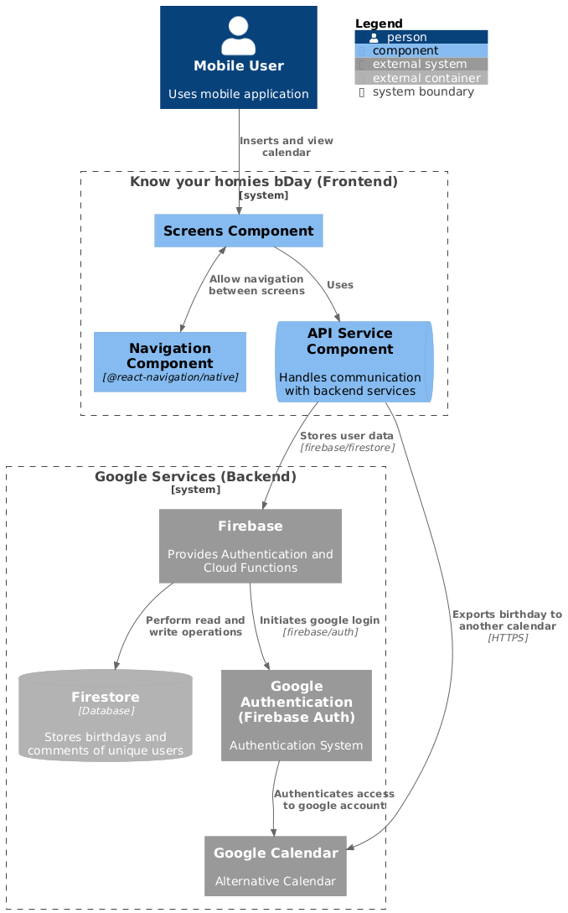

# What's Your Homie bDay

Aplikacja mobilna do zarządzania urodzinami znajomych i rodziny, stworzona w **React Native (Expo)**.
Tytuł roboczy: *“What's Your Homie bDay”*.

## Kluczowe funkcjonalności

- [ ] Logowanie za pomocą konta **Google**
- [ ] Przegląd urodzin w wygodnych widokach:
  - **Kalendarz** – lista urodzin na dany dzień
  - **Karty** – przegląd najbliższych urodzin
- [ ] Intuicyjne dodawanie, edytowanie i usuwanie danych osób
- [ ] Integracja z **Firebase** w celu przechowywania danych użytkowników


## Mockupy

### Widok logowania

Ekran odpowiedzialny za logowanie za pomocą konta Google.

<p align="center">
  
  
</p>

### Ekran główny

Główne widoki aplikacji:

- **Kalendarz** – prezentuje urodziny osób przypadające na wybrany dzień
- **Karty** – pokazuje osoby posortowane według daty najbliższych urodzin

<p align="center">
  
  
</p>

### Widok szczegółów

Sekcja z informacjami o wybranej osobie.

- Dostęp do widoku szczegółów po kliknięciu karty osoby
- Ikona w prawym górnym rogu pozwala przełączyć się na tryb edycji
- Czarny przycisk z ikoną „+” umożliwia dodanie nowej osoby

<p align="center">
  
  
  
</p>

## Diagramy

### C1

Przedstawia główne komponenty aplikacji i relacje między nimi.

<p align="center">
  
</p>

### C3

Prezentuje zależności pomiędzy warstwą logiki a komponentami widoku.

<p align="center">
  
</p>

##  Instrukcja uruchamiania

### Wymagania

- Node.js
- Zainstalowane **Expo CLI**
- Zainstalowane **Expo Go** na telefonie
- Konto **Firebase** (do obsługi backendu)

### Pierwsze kroki

1. Sklonuj repozytorium:

   ```bash
   git clone https://github.com/Vilczyca/PIM.git
   ```
2. Przejdź do katalogu projektu:

   ```bash
   cd pim
   ```
3. Zainstaluj zależności:

   ```bash
   npm install
   ```
4. Uzupełnij plik `.env` swoimi danymi

### Uruchamianie

1. Uruchom projekt w Expo:

   ```bash
   npx expo start
   ```

2. Zeskanuj kod QR w aplikacji **Expo Go** na telefonie, aby uruchomić projekt.
